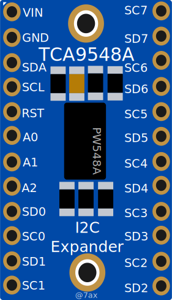

# TCA9548A I2C Multiplexer — Wokwi Custom Chip

A [Wokwi](https://wokwi.com/) custom chip simulating the [TCA9548A](https://www.ti.com/product/TCA9548A) 8-channel I2C multiplexer (Adafruit 2717 breakout form factor).



## Features

- Configurable 7-bit I2C address via A0, A1, A2 pins (0x70–0x77)
- 8-bit control register — each bit enables/disables one downstream channel
- Active-low hardware reset (RST pin)
- Power-on default: all channels disabled (0x00)

## Pin Table

| Pin | Side  | Description             |
|-----|-------|-------------------------|
| VIN | Left  | Power input             |
| GND | Left  | Ground                  |
| SDA | Left  | I2C data (upstream)     |
| SCL | Left  | I2C clock (upstream)    |
| RST | Left  | Active-low reset        |
| A0  | Left  | Address bit 0           |
| A1  | Left  | Address bit 1           |
| A2  | Left  | Address bit 2           |
| SD0 | Left  | Channel 0 data          |
| SC0 | Left  | Channel 0 clock         |
| SD1 | Left  | Channel 1 data          |
| SC1 | Left  | Channel 1 clock         |
| SD2 | Right | Channel 2 data          |
| SC2 | Right | Channel 2 clock         |
| SD3 | Right | Channel 3 data          |
| SC3 | Right | Channel 3 clock         |
| SD4 | Right | Channel 4 data          |
| SC4 | Right | Channel 4 clock         |
| SD5 | Right | Channel 5 data          |
| SC5 | Right | Channel 5 clock         |
| SD6 | Right | Channel 6 data          |
| SC6 | Right | Channel 6 clock         |
| SD7 | Right | Channel 7 data          |
| SC7 | Right | Channel 7 clock         |

## Usage in Wokwi

Add the chip to your `diagram.json`:

```json
{
  "type": "chip-tca9548a",
  "id": "mux1",
  "attrs": { "github": "7ax/wokwi-chip-tca9548a@1.0.0" }
}
```

Wire the upstream I2C bus (SDA/SCL) and connect A0, A1, A2 to set the address. Tie RST to VCC (or leave floating — it has an internal pull-up) for normal operation.

### Example Arduino Sketch

```cpp
#include <Wire.h>

#define TCA9548A_ADDR 0x70

void selectChannel(uint8_t channel) {
  Wire.beginTransmission(TCA9548A_ADDR);
  Wire.write(1 << channel);
  Wire.endTransmission();
}

uint8_t readChannels() {
  Wire.requestFrom(TCA9548A_ADDR, 1);
  return Wire.read();
}

void setup() {
  Serial.begin(115200);
  Wire.begin();

  // Enable channel 0
  selectChannel(0);
  Serial.print("Active channels: 0x");
  Serial.println(readChannels(), HEX);

  // Enable channels 2 and 5 simultaneously
  Wire.beginTransmission(TCA9548A_ADDR);
  Wire.write((1 << 2) | (1 << 5));
  Wire.endTransmission();
  Serial.print("Active channels: 0x");
  Serial.println(readChannels(), HEX);

  // Disable all channels
  Wire.beginTransmission(TCA9548A_ADDR);
  Wire.write(0x00);
  Wire.endTransmission();
  Serial.print("Active channels: 0x");
  Serial.println(readChannels(), HEX);
}

void loop() {}
```

## Simulation Fidelity Matrix

### Fully Simulated (High Confidence)

| Behavior | Notes |
|----------|-------|
| Control register read/write | Single byte, no sub-address — per datasheet |
| All 8 channel selection bits (0–7) | Bits 0–7 map to channels 0–7 |
| Configurable I2C address via A0/A1/A2 | 0x70–0x77, read once at power-on |
| Active-low hardware reset to 0x00 | RST pin, falling-edge triggered |
| Power-on default 0x00 | All channels disabled |
| Multi-byte write (last byte wins) | Per datasheet: no sub-address register, each byte overwrites |
| Multi-byte read (same value repeated) | Returns control register on every read byte |
| NACK on non-configured addresses | Chip only ACKs its own address |
| Address-only write (no data) preserves register | No data byte = no change to control register |

### NOT Simulated (Do Not Rely On)

| Behavior | Severity | Reason |
|----------|----------|--------|
| Downstream I2C bus switching (SD0–SC7) | **Critical** | Wokwi API has no I2C master/bus-bridging support |
| Bus switch propagation delay | Low | No downstream bus exists to propagate to |
| Reset minimum pulse width (6ns) | Low | Simulator resets on any falling edge (conservative) |
| Power-on reset timing (~2µs) | Low | Simulator is ready instantly; all firmware includes startup delays |
| Power supply current / bus capacitance | Low | Electrical simulation not in scope |

### Known Divergences from Real Hardware

1. **Downstream pins are non-functional** (Critical) — SD0–SC7 are declared as INPUT pins but never driven. Real hardware is a bilateral FET switch connecting upstream SDA/SCL to selected downstream SDn/SCn. Firmware that probes downstream pin states will NOT get meaningful results.
2. **No bus isolation** (Critical) — In real hardware, deselected channels are electrically isolated. In simulation, all Wokwi I2C devices share one bus regardless of channel selection.
3. **Reset has no minimum pulse width** (Low) — Real chip requires ≥6ns LOW pulse. Simulator resets on any falling edge. This is a conservative divergence (resets more readily than real hardware).
4. **Address pins read once** (None) — Real hardware uses resistor-set pins that don't change. Reading at init is correct behavior.
5. **Init-order assumption** (None) — `configured_addr` is zero before `chip_init` runs. Wokwi calls `chip_init` synchronously before any I2C traffic, so no I2C transaction can arrive with a stale address. If Wokwi ever changed to async init, this would need a sentinel value.
6. **A0/A1/A2 have internal pull-down** (None) — Real hardware address pins are high-impedance, set by external resistors. Simulation uses `INPUT_PULLDOWN` so floating pins default to LOW (address 0x70). This is conservative — it prevents address randomization from floating pins but may fight weak external pull-ups.
7. **Single-threaded callback assumption** (None) — `control_reg` is accessed from I2C and RST callbacks without synchronization. Wokwi executes all chip callbacks on a single thread. If this assumption ever changes, a mutex or atomic would be needed.

## Known Limitations

**No true I2C bus bridging.** The real TCA9548A is an electrical bus switch — it physically connects the upstream SDA/SCL lines to the selected downstream SDn/SCn lines. Wokwi's custom chips API does not support dynamic electrical bus bridging between pins.

This chip implements the **control interface only**: writing the channel selection register, reading it back, and hardware reset. The downstream channel pins (SD0–SD7, SC0–SC7) are declared but do not electrically bridge to the upstream bus.

**Workaround for Wokwi projects:** Wire all downstream I2C devices directly to the same Wokwi I2C bus. Since each device has its own unique I2C address, they coexist on the bus. Your firmware still writes to the TCA9548A to select channels (maintaining code compatibility with real hardware), but in simulation, the downstream devices respond regardless of which channel is selected.

## Test Traceability

22 tests validate all simulated behaviors against the TCA9548A datasheet.

| Test | Behavior Validated | Datasheet Reference |
|------|--------------------|---------------------|
| 1 | Device ACKs at configured address (0x70) | §7.3 I2C Address |
| 2 | No response at 0x71 (address filtering) | §7.3 I2C Address |
| 3 | Power-on default register = 0x00 | §7.4 Reset |
| 4 | Write 0x01 / read back | §7.5 Control Register |
| 5 | Write 0xFF / read back | §7.5 Control Register |
| 6 | Overwrite replaces (not OR) | §7.5 Control Register |
| 7 | RST pin resets register to 0x00 | §7.4 Reset |
| 8 | Write 0x00 clears all channels | §7.5 Control Register |
| 9 | Each channel bit independently selectable | §7.5 Bit 0–7 |
| 10 | Multi-channel patterns (0x55, 0xAA, etc.) | §7.5 Control Register |
| 11 | Read after RST returns 0x00 | §7.4 Reset |
| 12 | Multi-byte read returns same value 3× | §7.5 No sub-address |
| 13 | Multi-byte write: last byte wins | §7.5 No sub-address |
| 14 | RST clears 0x55 to 0x00 | §7.4 Reset |
| 15 | Double RST — chip remains functional | §7.4 Reset |
| 16 | Write after RST restores normal operation | §7.4 Reset |
| 17 | All 256 values (0x00–0xFF) round-trip | §7.5 Control Register |
| 18 | Addresses 0x71–0x77 all NACK | §7.3 Address pins |
| 19 | Zero-length write preserves register | §7.5 No sub-address |
| 20 | endTransmission(false) preserves register | §7.5 No sub-address |
| 21 | Rapid RST with no delays | §7.4 Reset |
| 22 | Back-to-back write-read stress (16 patterns) | §7.5 Control Register |

## I2C Address Configuration

| A2 | A1 | A0 | Address |
|----|----|----|---------|
| 0  | 0  | 0  | 0x70    |
| 0  | 0  | 1  | 0x71    |
| 0  | 1  | 0  | 0x72    |
| 0  | 1  | 1  | 0x73    |
| 1  | 0  | 0  | 0x74    |
| 1  | 0  | 1  | 0x75    |
| 1  | 1  | 0  | 0x76    |
| 1  | 1  | 1  | 0x77    |

## Building Locally

Requirements: [WASI SDK](https://github.com/WebAssembly/wasi-sdk) installed at `/opt/wasi-sdk` (or set `WASI_SDK_PATH`).

```bash
make
```

This downloads `wokwi-api.h` if missing and produces `dist/chip.wasm` and `dist/chip.json`.

## Datasheet

[TCA9548A Datasheet (TI)](https://www.ti.com/lit/ds/symlink/tca9548a.pdf)

## License

[MIT](LICENSE)
